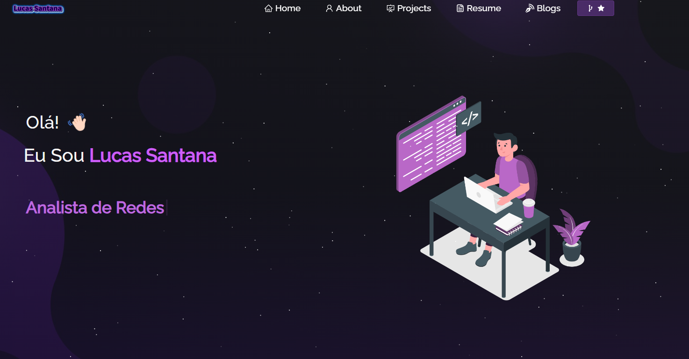

<h2 align="center">
  Portfolio Website - v2.0 
  <a href="https://lmsantana.com.br" target="_blank">lmsantana.com.br</a>
</h2>

  

 

 &nbsp;
 &nbsp;
 &nbsp;

<h3 align="center">
    🔹
    <a href="https://github.com/LucasSantanaRM/portifolio-react/issues">Report Bug</a> &nbsp; &nbsp;
    🔹
    <a href="https://github.com/LucasSantanaRM/portifolio-react/issues">Request Feature</a>
</h3>

Este projeto foi construído usando essas tecnologias.

- React.js
- Node.js
- Express.js
- CSS3
- VsCode
- Vercel

## Características

**📖 Layout de várias páginas**

**🎨 Estilizado com React-Bootstrap e Css com cores fáceis de personalizar**

**📱Totalmente Responsivo**

## Começando

Clone este repositório. Você precisará de `node.js` e `git` instalados globalmente em sua máquina.

## 🛠 Instruções de instalação e configuração

1. Instalação: `npm install`

2. No diretório do projeto, você pode executar: `npm start`

Executa o aplicativo no modo de desenvolvimento.\
Abra [http://localhost:3000](http://localhost:3000) para visualizá-lo no navegador.
A página será recarregada se você fizer edições.

## Instruções de uso

Abra a pasta do projeto e navegue até `/src/components/`.  
Você encontrará todos os componentes usados ​​e poderá editar suas informações de acordo.

### Mostre seu apoio

Dê um ⭐ se você gosta deste site!

